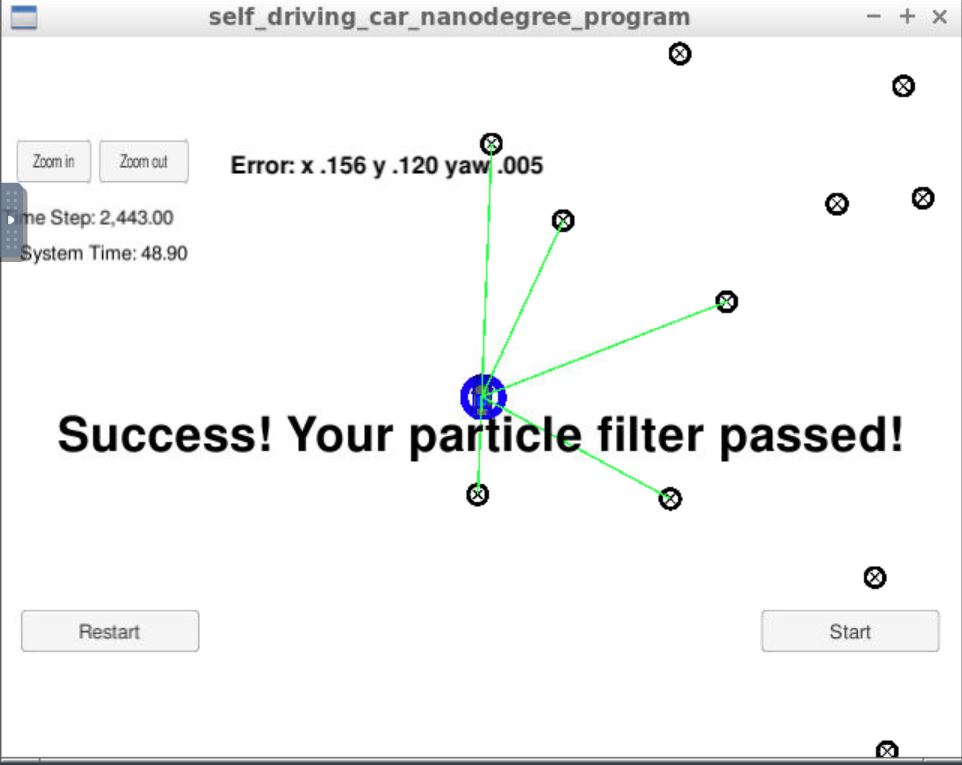

# Kidnapped Vehicle Project 
Self-Driving Car Engineer Nanodegree Program



The goals and steps of this project are as follows :
* Accuracy : Meets specifications when output says "Success! Your particle filter passed!" then it means you’ve met this criteria. 
* Performance : Meets specifications when output says "Success! Your particle filter passed!" then it means you’ve met this criteria. 
* General : Meets Specification


# Developments Steps

The project was developed in C/C++ and the file in ./particle_filter.cpp was modified to achieve project objectives.
The "TO-DO" section in below functions were modified :

```
void ParticleFilter::init(double x, double y, double theta, double std[])

void ParticleFilter::prediction(double delta_t, double std_pos[], 
                                double velocity, double yaw_rate) 

void ParticleFilter::dataAssociation(vector<LandmarkObs> predicted, 
                                     vector<LandmarkObs>& observations)

void ParticleFilter::updateWeights(double sensor_range, double std_landmark[], 
                                   const vector<LandmarkObs> &observations, 
                                   const Map &map_landmarks) 
void ParticleFilter::resample() 

```

Landmarks data was read from a txt file and the observations & motion data was provided by Simulator to the C++ code through websockets.
Udacity provided Term2 simulator was used to check the results.
